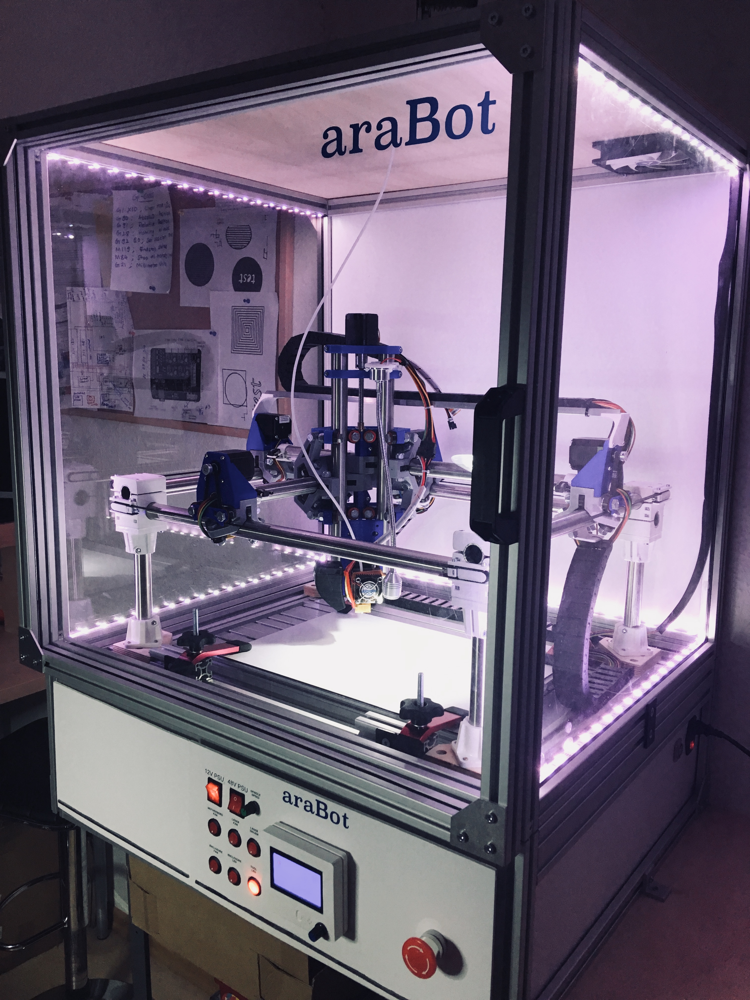
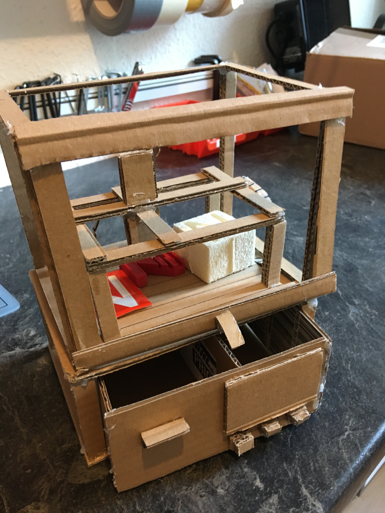
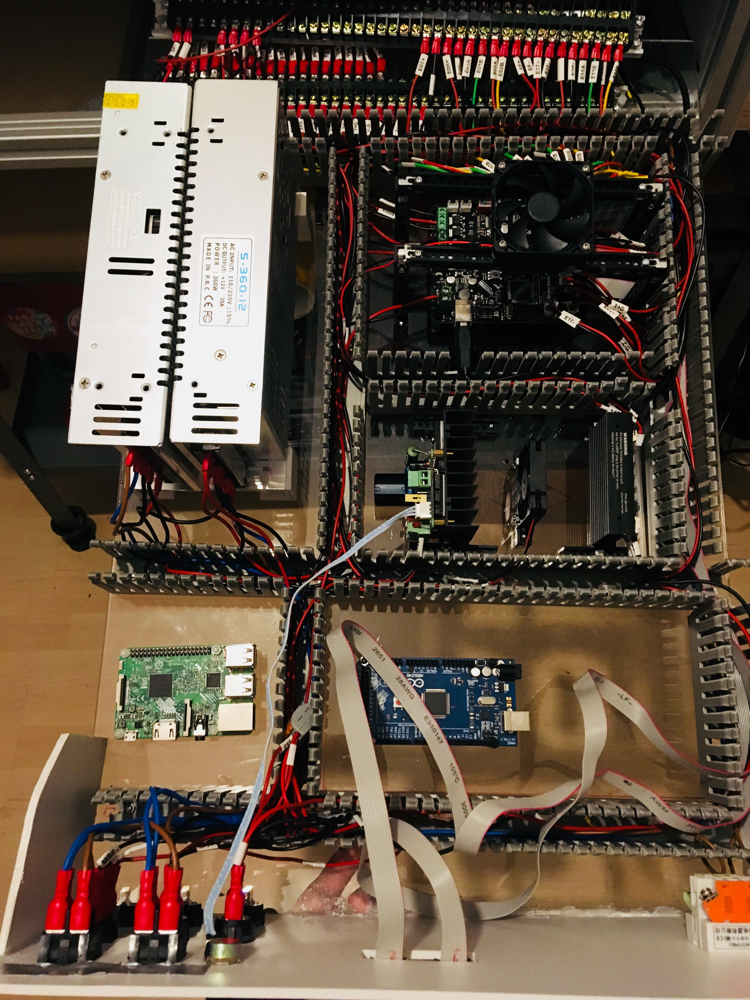

# araBot
araBot is a multipurpose digital fabrication machine based on existing opensource designs. An effort to build an environment awareness machine with Industry 4.0 and IoT principles.

araBot is capable of doing CNC Milling, 3D Printing, PCB Milling, Laser Engraving & Cutting, Vinyl Cutting, Plotting and Food Printing. Therefore, it is able to do subtractive and additive fabrication with endless possibilities.

araBot doesn't limit itself to be a simple desktop fabrication machine, but step-by-step integrating Industry 4.0 and IoT technologies into it as a research, to foresee the future digital fabrication machines. For instance, a 3D depth sensor will be used to create a point-cloud of the workpiece on the build-platform/spoil-board, thereby creating the digital twin. Furthermore, acoustic beam-forming will be used as an active-noise -cancellation to suppress the high frequency noises produced during the operation of the machine.

araBot was conceived from the RepRap philosophy, that it should be able to make it's own parts by processing various material. Majority of this is based on MPCNC project.

Additionally, the control-box is built using industrial automation standard with wire-raceways, motion  controlling firmware is Marlin, external structure is built using T-Slot Aluminum profiles, peripherals control is built using Arduino Mega and IoT component of the project is built using RaspberryPi.

